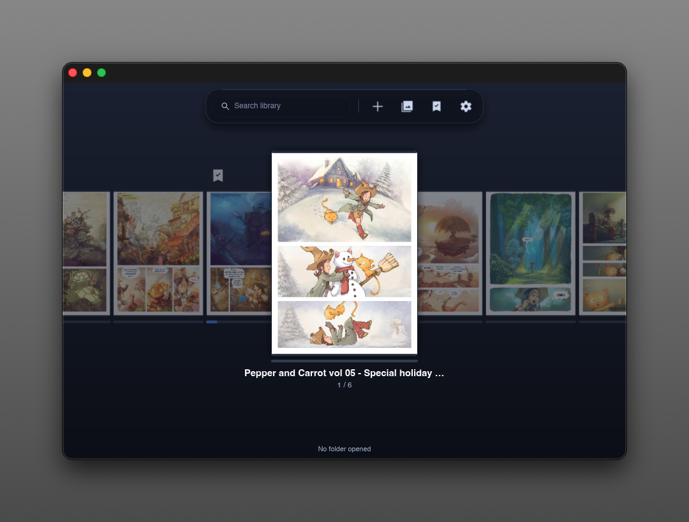
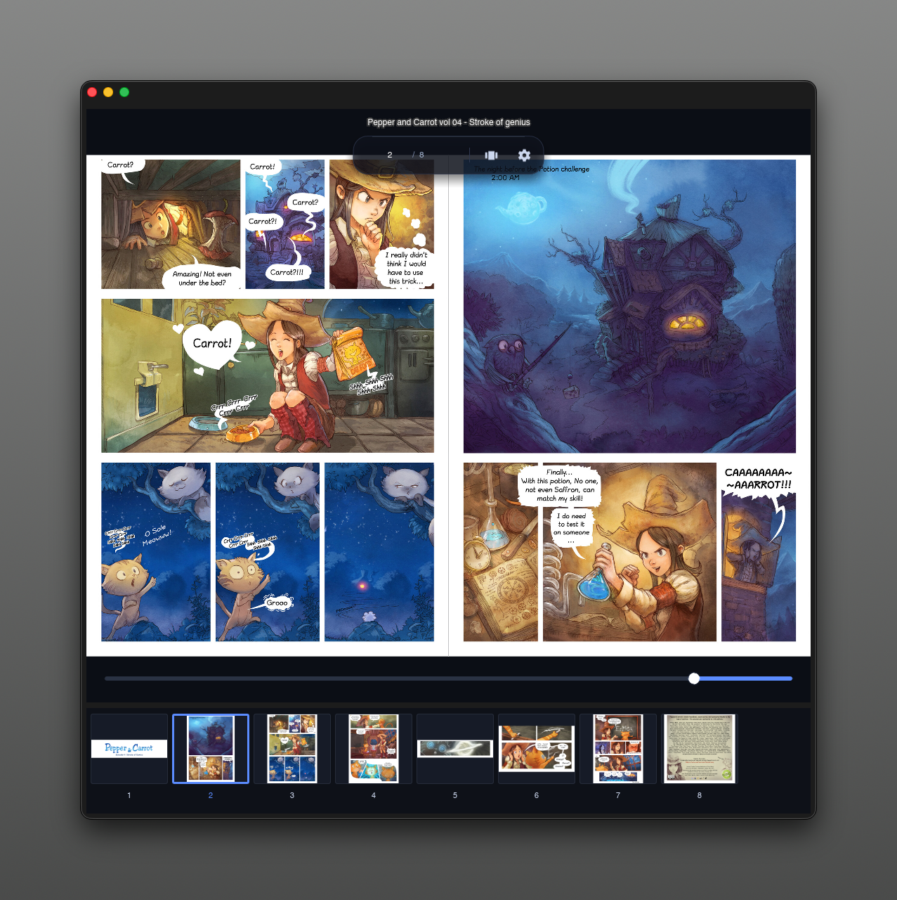
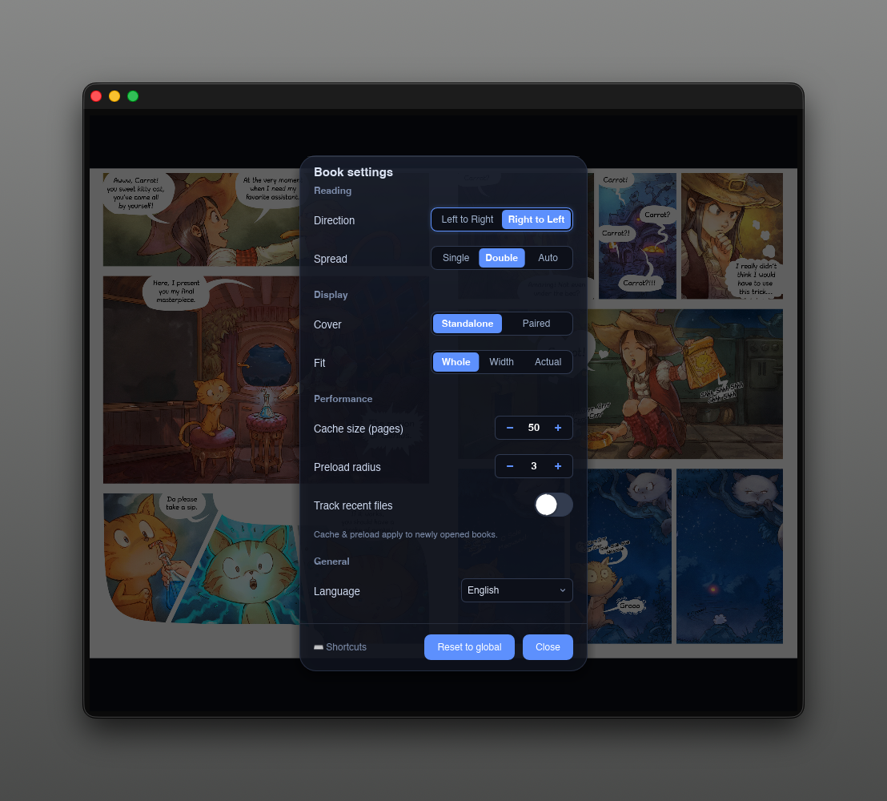

#  gashuu

## A fast, elegant manga / comic reader built for immersive viewing.

[](https://github.com/yasuflatland-lf/gashuu/actions/workflows/ci.yml)
[](https://codecov.io/gh/yasuflatland-lf/gashuu)

| Library | Viewer | Settings |
| :---: | :---: | :---: |
|  |  |  |

A cross-platform manga / comic viewer built with Rust and [Slint](https://slint.dev).

Open a folder of images or a comic archive and read with the keyboard — two-page
spreads, right-to-left binding, zoom/pan, a thumbnail strip, a cover-flow library,
and persistent settings, in an English / 日本語 UI.

## Getting Started

### macOS release install

macOS builds are ad-hoc signed (self-signed) but not notarized by Apple. If macOS blocks
`gashuu.app` on first launch, follow these steps:

1. Move `gashuu.app` to the `/Applications` folder.
2. Try opening `gashuu.app` normally and accept the error dialog.
3. Open **System Settings > Privacy & Security**.
4. Scroll down to the Security section. You will see a message that gashuu was blocked.
5. Click **Open Anyway** and enter your Mac's password.

This is a temporary workaround until Developer ID signing and notarization are added.

## Features

- **Sources** — a folder of PNG/JPG/JPEG/AVIF images, or a `.cbz`/`.zip`/`.cbr`/`.rar`
  archive. The format is detected by extension or magic bytes, so a mis-named archive
  still opens.
- **Archives** — pages are read in natural filename order and images nested in
  subfolders are included. Extraction is in-memory (nothing is written to disk); unsafe,
  oversized, or corrupt entries are skipped and counted in the status bar.
- **Library** — a cover-flow carousel with real cover art and per-book reading-progress
  bars, in numeric-aware title order (*vol 1*, *vol 2*, *vol 10* sort naturally). Empty
  folders/archives are rejected on add and auto-removed if found empty later. The NavBar
  includes a live search field that filters books by title or path.
- **Spreads** — single page, two-page spread, or **auto** (picks single/double from the
  window aspect ratio and follows resizes live). Right-to-left (manga) or left-to-right
  binding, with a standalone or paired cover layout.
- **Per-book view settings** — reading direction, spread, cover layout, and fit mode are
  remembered per book (falling back to your global defaults), so each title reopens the way
  you left it; the Viewer settings dialog can reset a book back to the global defaults.
- **Zoom & pan** — the wheel zooms at the cursor and drag pans; fit modes are Whole /
  Width / Actual. Zoom and pan are session-only; the fit mode is saved.
- **Fast page turns** — pages are held in an LRU cache and neighbours are prefetched in
  the background, so warmed turns are effectively instant.
- **Thumbnail strip** — previews of every page, generated in parallel so the strip fills
  in while you read. Click a thumbnail to jump; the current page is highlighted; a
  thumbnail that fails to generate shows a red ✕.
- **Page scrubber & counter** — a bottom scrub bar and a top-right page-counter chip
  appear on mouse-move, arrow-key press, or scrubber drag, then fade after idle. Drag the
  knob to scrub; a thumbnail preview pops up during the drag and the page changes on
  release. RTL-aware: in manga mode dragging left advances pages.
- **Continue reading** — re-opening a book resumes at the last page you read. The Library
  marks and auto-focuses the most recently opened book with a bookmark ribbon; returning
  from the Viewer lands the carousel on it immediately, and the NavBar's bookmark button
  jumps straight back into that book.
- **Selection & bulk delete** — press `x` in the Library (or click the NavBar's **Select**
  button) to enter selection mode, then toggle books with `x` / `Space` / a cover click,
  select all visible with `Cmd/Ctrl+A`, and delete the selection with `Delete` or
  `Backspace`. A confirm dialog lists the titles and confirms that files on disk are kept
  (only the library entry is removed). No undo; the confirm dialog is the safety gate.
- **Settings dialog & first-run guide** — change every active option from the in-app
  Settings dialog without hand-editing config, and a one-time welcome overlay summarises
  the controls.
- **Bilingual UI** — English / 日本語, switchable instantly (no restart) from the Settings
  dialog's General → Language pull-down; the choice persists.
- **Safe decoding** — oversized images and decompression bombs are rejected before
  allocating memory (16 384×16 384 px / 512 MiB / ~128 Mpx limits), with a clear error
  in the status bar instead of an out-of-memory crash.

*gashuu* (画集, [ɡaɕɯː]) is the Japanese for a book or booklet of drawings — an
art book. It is a manga viewer, but the name carries a wish: that it be as refined and
tasteful a tool as a fine art book.

## Usage

Add books from the Library's NavBar — on macOS a single **Add books** button (one picker
accepts files and folders); on Windows/Linux separate **Add files**
(`.cbz`/`.zip`/`.cbr`/`.rar`) and **Add folder** (a folder of PNG/JPG/JPEG/AVIF images becomes
one book) buttons. An empty library shows a call-to-action that opens the same picker.
Double-click the centered cover (or press `Enter`) to start reading; clicking left or right
of it steps the carousel one book per click. Navigation works the same for folders and
archives.

**Library**

| Key / Gesture | Action |
|---------------|--------|
| `←` / `→` | Move the carousel focus |
| Click left / right of the centered cover | Move the carousel focus one book |
| Two-finger horizontal swipe | Move the carousel one book per swipe |
| `Enter` | Open the focused book |
| Double-click the centered cover | Open it |
| `↓` | Return to the open book (if any) |
| `/` | Focus the search field |
| `x` | Enter selection mode |

**Navigation (Viewer)**

| Key / Gesture | Action |
|---------------|--------|
| `→` / `Space` | Next page or spread |
| `←` / `Backspace` | Previous page or spread |
| Two-finger horizontal swipe | Next / previous page or spread (disabled while zoomed in) |
| `D` | Cycle spread mode: single → double → auto |
| `R` | Toggle reading direction (LTR ↔ RTL) |
| `C` | Toggle cover layout (standalone ↔ paired) |
| `T` | Toggle the thumbnail strip |
| `↑` | Return to the Library |

Arrows follow the reading direction (LTR: `→` = next; RTL: `←` = next). Clicking the
left or right half of the page turns it the same way the arrows do (a drag still pans —
only a clean click turns). `Space` and `Backspace` are always next/previous in reading
order. `D` / `R` / `C` mode changes are remembered per book, so the book reopens the way
you left it.

**Selection mode (Library)**

| Key | Action |
|-----|--------|
| `x` | Enter selection mode and toggle the focused book |
| `Space` | Toggle the focused book's selection (selection mode only) |
| `Cmd/Ctrl+A` | Select all visible / deselect all visible |
| `Delete` / `Backspace` | Delete selected books (opens confirm dialog) |
| `Esc` | Exit selection mode |

A confirm dialog lists the titles before deleting and notes that files on disk are kept —
only the library entries are removed. The action is not undoable; `Enter` maps to Cancel
so the destructive path is never a single keypress.

The **page scrubber** (bottom bar) and **page-counter chip** (top-right) appear on
mouse-move, arrow-key press, or scrubber drag, then fade after idle. Drag the knob to
preview pages without turning; the page changes on release. In RTL mode dragging left
advances pages.

The Viewer's bottom **pill** holds a `page / total` jump field (type a page number and
press `Enter` to jump; `Esc` cancels), a thumbnail-strip toggle, and the settings button.

**Zoom & fit** (direction-independent)

| Input | Action |
|-------|--------|
| Mouse wheel | Zoom at the cursor (1.0×–8.0× of the fit baseline) |
| Click-drag | Pan the viewport |
| `+` / `=` | Zoom in |
| `-` | Zoom out |
| `0` | Reset view (fit baseline, re-centered) |
| `1` | Actual size (1:1 pixels) |
| `f` | Cycle fit mode (Whole → Width → Actual) |

Zoom and pan apply to the whole viewport (both pages in a spread move together). Page
turns keep the current zoom and fit and only re-center the pan. Set `RUST_LOG=debug` to
log per-turn latency.

**Settings dialog** — click the settings icon (in the Library's NavBar, or the Viewer's
bottom pill) to change reading direction, spread mode, cover layout, fit mode, cache
size, preload radius, the recent-files toggle, and the UI language (English / 日本語,
applied immediately). Scope follows the screen: from the **Library** it edits your GLOBAL
defaults; from the **Viewer** it edits the CURRENT book's view settings (with a "Reset to
global" button). Display-mode changes apply immediately; cache size and preload radius
take effect on the next book you open. The dialog also has two immediate cleanup buttons:
**Clear reading history** forgets every added book and the recent-files list (a book open
in the current session stays open), and **Clear cover cache** deletes the on-disk
cover/thumbnail files and reports how much space was reclaimed. The dialog's footer has a
**Shortcuts** link that opens a separate overlay listing the keyboard shortcuts (remapping
is not yet supported).

## Settings

Settings are stored as JSON in the OS config directory, loaded on startup and saved on
exit. The Settings dialog is the easiest way to change them, but the file can be
hand-edited:

| Platform | Path |
|----------|------|
| Linux    | `~/.config/gashuu/settings.json` |
| macOS    | `~/Library/Application Support/gashuu/settings.json` |
| Windows  | `%APPDATA%\gashuu\settings.json` |

| Key | Values | Notes |
|-----|--------|-------|
| `reading_direction` | `"ltr"` / `"rtl"` (default) | Right-to-left = manga binding |
| `spread_mode` | `"single"` / `"double"` / `"auto"` (default) | Auto chooses from the window aspect ratio |
| `cover_mode` | `"standalone"` (default) / `"paired"` | Applies to double mode only |
| `fit_mode` | `"whole"` / `"width"` (default) / `"actual"` | Initial fit; cycle with `f` |
| `cache_size` | int (default `50`) | LRU decoded-image cache; applies to the next book |
| `preload_pages` | int (default `3`) | Background prefetch radius; applies to the next book |
| `track_recent_files` | bool (default `false`) | Off for privacy; gates `recent_files` |
| `recent_files` | list | Recorded only when tracking is on |
| `language` | `"en"` (default) / `"ja"` | UI language; switchable live from the Settings dialog |

The library itself — added books, last-read pages, per-book view overrides, and the
continue-reading bookmark — is stored separately as `library.json` in the OS data
directory.

If the settings or library file is corrupt or unreadable, gashuu falls back to built-in
defaults (an empty library) and keeps running.

## Project layout

- `crates/gashuu-core` — Slint-independent domain + I/O: folder, ZIP/CBZ, and RAR/CBR
  page sources, image decode, LRU cache + prefetch, thumbnails, and settings.
- `crates/gashuu` — Slint presentation layer (windows, dialogs, input, rendering).

## Development

### Setup

Toolchain and tools are managed by [mise](https://mise.jdx.dev) (Rust 1.96.0 +
cargo-nextest + cargo-llvm-cov):

```bash
mise trust      # trust ./mise.toml (once per fresh clone)
mise install
```

On Linux, install Slint's system libraries and the dav1d AV1 decoder (AVIF support):

```bash
sudo apt-get install -y libfontconfig1-dev libfreetype6-dev libxcb1-dev \
  libxcb-render0-dev libxcb-shape0-dev libxcb-xfixes0-dev libxkbcommon-dev \
  libdav1d-dev
```

On macOS, install dav1d with Homebrew; on Windows, via vcpkg (see
[docs/toolchain.md](docs/toolchain.md) for the build-environment variables):

```bash
brew install dav1d                          # macOS
vcpkg install dav1d:x64-windows-static-md   # Windows
```

A C++ compiler is also required — the RAR/CBR backend bundles the C++ UnRAR sources and
builds them via `cc`. This is standard on every platform (Xcode CLT on macOS, MSVC or
MinGW on Windows, `build-essential` on Linux) and adds nothing beyond the usual toolchain.
dav1d and the C++ compiler are BUILD-time requirements only — the released app bundles
everything and end users install nothing.

Then run the viewer and add books from the Library's nav bar:

```bash
cargo run -p gashuu
```

### Quality gates

```bash
mise exec -- cargo fmt --check
mise exec -- cargo clippy --workspace --all-targets -- -D warnings
mise exec -- cargo nextest run --workspace --profile ci
```

## License

MIT — see [LICENSE](LICENSE). The RAR/CBR backend uses the UnRAR library, which carries
RARLAB's non-free license (read-only use is permitted; re-creating the RAR compression
algorithm is not). The AVIF decoder links dav1d (BSD-2-Clause). See
[THIRD_PARTY_LICENSES.md](THIRD_PARTY_LICENSES.md) for the full license texts.

Artwork in screenshots: [*Pepper&Carrot*](https://www.peppercarrot.com) by David Revoy,
[CC-BY 4.0](https://creativecommons.org/licenses/by/4.0/).
